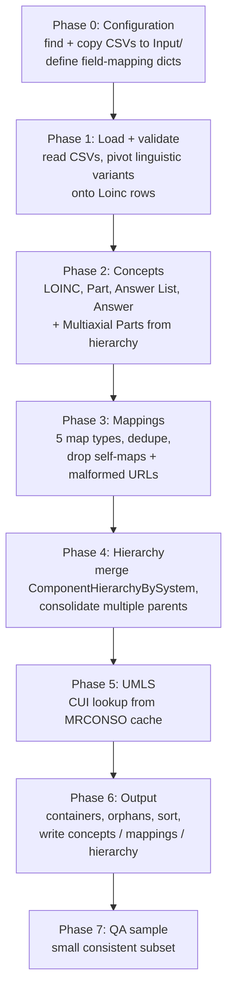

# 01. Pipeline Overview

The whole transformation lives in one Jupyter notebook,
[`loinc_to_ocl_transformer.ipynb`](../loinc_to_ocl_transformer.ipynb). It is meant to
be run top to bottom. Every phase reads global variables (mostly pandas DataFrames) set
by earlier phases. Running cells out of order, or re-running a single cell after
changing an earlier one, can leave stale state. When in doubt, restart the kernel and
run all.

## Runtime and dependencies

- Python 3.13 (`.python-version`), managed with `uv` (`pyproject.toml`, `uv.lock`).
- Runtime libraries: `pandas`, `numpy`, `requests`.
- Dev group for headless execution: `jupyter`, `nbconvert`, `ipykernel`.
- A full run takes a few minutes. Most of the time goes to row-by-row `iterrows()`
  loops and the Phase 6 hierarchical sort.
- Memory: the full concept DataFrame is wide (one column per name type and locale
  combination, see [04](04-field-mappings.md#linguistic-variants)). Expect several GB
  of RAM.

## Phase map

## Phase by phase

Cell numbers refer to the 0-based cell index in the notebook as of the 2.82 run.

### Phase 0: Configuration and field mapping (cells 0 to 12)

| Cell | What it does | Key globals set |
|---|---|---|
| 1 | Markdown notes: fixed issues, open issues, missing features. | |
| 3 | **File discovery.** Walks `source_loinc_directory` recursively and copies the seven required CSVs into `Input/`. Copies every linguistic variant CSV into `Input/LinguisticVariants/` with its original name. Needs at least 4 of the 7 files to continue. | `source_loinc_directory`, `*_csv_path` |
| 4 | Org/source names and default input paths. `mode = 0` is the only working mode. | `global_organization = "Regenstrief"`, `global_source = "LOINC"`, `mode` |
| 5 | Imports. | |
| 6 | Commented-out demo data (dead code). | |
| 7 | Field map for LOINC terms. | `loinc_to_ocl_mapping`, `fixed_values_loinc` |
| 8 | Field map for LOINC Parts. | `loinc_part_to_ocl_mapping`, `fixed_values_loinc_parts` |
| 9 | Field maps for Answer Lists and Answers. | `answer_list_to_ocl_mapping`, `answer_to_ocl_mapping`, `fixed_values_answer_list`, `fixed_values_answer` |
| 10 | Value transformation rules (STATUS to `retired`, rank cleanup). | `transformation_rules` |
| 11 | Mapping configurations for the five map types. | `CONCEPT_URL_PREFIX`, `MAPPING_CONFIGS` |
| 12 | Column map for `ComponentHierarchyBySystem.csv`. | `hierarchy_mapping` |

All the dictionaries in cells 7 to 12 are documented column by column in
[04 Field mappings](04-field-mappings.md).

### Phase 1: Data loading and validation (cells 13 to 15)

- **Cell 14** loads `Loinc.csv`, `Part.csv`, `AnswerList.csv`, every linguistic
  variant CSV, and `ComponentHierarchyBySystem.csv` (renamed per `hierarchy_mapping`).
  All reads use `keep_default_na=False`, so blank cells become empty strings, not NaN.
  - Globals: `loinc_df`, `part_link_df`, `answer_list_df`, `linguistic_variant_dfs`, `hierarchy_df`.
- **Cell 15** turns each linguistic variant file into long-form rows of
  (`LOINC_NUM`, locale, name, name type). It then pivots them into wide
  `names.<NameType>.<locale>[n]` columns and left-joins them onto `loinc_df`.
  - Global: `merged_loinc_df`.

### Phase 2: Concept creation (cells 16 to 25)

- **Cell 17** defines the generic row-to-concept builder, `create_ocl_concept_from_row`.
  It applies a field map, then fixed values, then transformation rules. The same cell
  defines one processor per concept type. It also prints a warning for any source column
  not covered by a field map (`check_for_unmapped_fields`).
- **Cell 19** runs the processors. It builds one `LOINC` concept per `Loinc.csv` row,
  one `LOINC Part` per unique `PartNumber`, and one `Answer List` per unique
  `AnswerListId`. It also builds one `LOINC Answer` per unique `AnswerStringId`, tagging
  it with the first `AnswerListId` it appeared under (`ParentAnswerListId`).
  - Global: `all_ocl_concepts_df_sorted`.
- **Cells 23 to 25** add **multi-axial parts**. These are `LP` codes that appear in
  `ComponentHierarchyBySystem.csv` but were not created from `Part.csv`, excluding
  `LP432695-7` (`{component}`). They are built as class `LOINC Part (Multiaxial)` and
  appended to `all_ocl_concepts_df_sorted`.

### Phase 3: Mapping creation (cells 26 to 31)

- **Cell 27** loads `PanelsAndForms.csv`, `LoincAnswerListLink.csv`, `AnswerList.csv`,
  `Loinc.csv` and `MapTo.csv` again, as separate DataFrames.
- **Cell 28** runs `process_mappings()` once per `MAPPING_CONFIGS` entry.
  - `Question-to-Answer` first inner-joins `LoincAnswerListLink` to `AnswerList` on
    `AnswerListId`.
  - `Ask at Order Entry` only processes rows with a non-blank `AskAtOrderEntry`.
  - `Associated Observations` splits delimited codes into one row each.
  - A mapping is kept only if both `from_concept_url` and `to_concept_url` were
    produced.
- **Cell 29** deduplicates on (`from_concept_url`, `to_concept_url`, `map_type`) and
  keeps the first row of each group.
- **Cell 30** reports pairs with more than one `map_type` (report only, nothing is
  removed) and **removes self-maps**.
- **Cell 31** strips empty extras and **removes mappings whose `to_concept_url`
  contains `/concepts//`** (a blank target code).
  - Global: `final_list_of_mappings`.

### Phase 4: Hierarchy creation (cells 32 to 34)

- **Cell 33** prints a branch/leaf breakdown of the hierarchy file (informational only).
- **Cell 34** left-joins every concept to every hierarchy row on `id = CODE`. Then it
  groups by concept `id`, collecting all distinct parents. When a concept has no
  hierarchy parent, it falls back to `ParentAnswerListId` (which is how Answers get
  their Answer List as parent). Finally it builds the `parent_concept_urls` list.
  - Global: `concepts_with_hierarchy_df`.

See [05 Hierarchy model](05-hierarchy-model.md) for the full rules.

### Phase 5: UMLS enhancement (cells 35 to 38)

- **Cell 36** is a commented-out duplicate-ID debugger.
- **Cell 37** sets up the CUI cache. If `loinc_cui_simple_lookup_<umls_release>.json`
  does not exist and `Input/MRCONSO.RRF` does, it extracts LOINC CUIs from the RRF into
  that cache file. Filters: `SAB = LNC`, code contains `-`, `TS = P`, `SUPPRESS = N`,
  `LAT = ENG`.
- **Cell 38** looks up every concept ID except Answer Lists in the cache. There are no
  live API calls: `api_key=None`. It sets both `external_id` and `extras.UMLS_CUI` to
  the CUI. If no cache is available the phase is a no-op.
  - Global: `merged_loinc_cui_df`.

### Phase 6: Output generation (cells 39 to 44)

- **Cell 40** creates `ROOT`, `OTHER` and four class containers. It assigns any concept
  still lacking a parent to its class's container, or to `ROOT` for the four top-level
  LOINC Parts. It runs a cycle and missing-parent diagnostic, then sorts concepts so
  parents come before children.
  - Global: `merged_loinc_cui_df_for_output`.
- **Cell 41** normalizes empty values and drops working columns (`parent_concept`,
  `match-id`, `ParentAnswerListId`).
- **Cell 42** converts each row into a nested OCL JSON object and writes
  `output/concepts.json` and `output/mappings.json`.
  - Flat `names.*` columns become a `names` list.
  - `description` becomes a `descriptions` list.
  - Flat `extras.*` columns become an `extras` dict.
  - Empty values are removed.
  - Globals: `concepts_data`, `mappings_data`.
- **Cell 43** writes `output/hierarchy_only.json`, a dict of parent URL to sorted child
  URLs.
- **Cell 44** is the "Now What?" checklist for importing into OCL (expanded in
  [06 Release process](06-release-process.md)).

### Phase 7: QA load sample (cells 45 to 46)

Builds a small, internally consistent subset of `concepts_data` and `mappings_data` and
writes it to `QA-Load-files/`. Selection logic is in the top-level
[README](../README.md#whats-in-the-qa-load-sample). The 2.82 sample has 55 concepts
(all seven concept classes) and 6 mappings (all five map types).

## State that crosses phases

| Global | Built in | Consumed by |
|---|---|---|
| `merged_loinc_df` | Phase 1 | Phase 2 |
| `part_link_df`, `answer_list_df` | Phase 1 | Phase 2 |
| `hierarchy_df` | Phase 1 | Phase 4 |
| `all_ocl_concepts_df_sorted` | Phase 2 | Phase 4 (also used to find missing Multiaxial parts) |
| `final_list_of_mappings` | Phase 3 | Phase 6 |
| `concepts_with_hierarchy_df` | Phase 4 | Phase 5 |
| `merged_loinc_cui_df` | Phase 5 | Phase 6 |
| `merged_loinc_cui_df_for_output` | Phase 6 cell 40 | Phase 6 cells 41 to 43 |
| `concepts_data`, `mappings_data` | Phase 6 cell 42 | Phase 7 |

Two traps to be aware of:

- Phase 6 cell 40 skips container creation if `ROOT` and a container already exist in
  the DataFrame. This only happens when re-running without restarting the kernel.
- Phase 3 re-reads `Loinc.csv` and `AnswerList.csv` from disk, independently of
  Phase 1. Editing a DataFrame in Phase 1 does not affect mappings.
