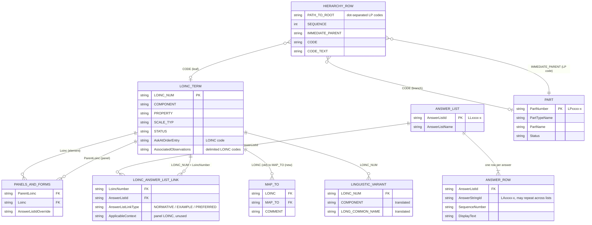

# 02. Input Model

This doc describes the data the pipeline reads: seven LOINC release CSVs, the linguistic
variant CSVs, and optionally UMLS `MRCONSO.RRF`. It also covers the one hand-maintained
input: the OCL Source definition.

## Where the inputs come from

A LOINC release is downloaded from <https://loinc.org/downloads/> and unzipped under
`ocl-content/LOINC/loinc-releases/` (for example `loinc-releases/Loinc_2.82/`). Phase 0
searches that folder recursively and copies what it needs into `LOINC-OCL-ETL/Input/`.

| Required file (as copied to `Input/`) | Location inside the 2.82 release zip |
|---|---|
| `Loinc.csv` | `LoincTable/` (identical copy also in `AccessoryFiles/PanelsAndForms/`) |
| `MapTo.csv` | `LoincTable/` (identical copy also in `LoincTableCore/`) |
| `Part.csv` | `AccessoryFiles/PartFile/` |
| `AnswerList.csv` | `AccessoryFiles/AnswerFile/` (identical copy also in `AccessoryFiles/PanelsAndForms/`) |
| `LoincAnswerListLink.csv` | `AccessoryFiles/AnswerFile/` (identical copy also in `AccessoryFiles/PanelsAndForms/`) |
| `PanelsAndForms.csv` | `AccessoryFiles/PanelsAndForms/` |
| `ComponentHierarchyBySystem.csv` | `AccessoryFiles/ComponentHierarchyBySystem/` |
| `LinguisticVariants/*.csv` | `AccessoryFiles/LinguisticVariants/` |

> **Duplicate copies.** Phase 0 takes the first match `os.walk` finds and does not say
> which copy it picked. In 2.82 every duplicate pair is byte-identical, so it does not
> matter. If LOINC ever ships a subset under `PanelsAndForms/`, the wrong copy could be
> used silently. The release checklist in [06](06-release-process.md) includes a check.

### Release files the pipeline does not use

These ship in the release but are not read: `LoincTableCore.csv`,
`SourceOrganization.csv`, `LoincPartLink_Primary.csv`,
`LoincPartLink_Supplementary.csv`, `PartRelatedCodeMapping.csv`, the `GroupFile/`
tables, `ConsumerName.csv`, `ChangeSnapshot/`, `DocumentOntology/`,
`ImagingDocuments/`, `LoincIeeeMedicalDeviceCodeMappingTable/`,
`LoincRsnaRadiologyPlaybook/`, `LoincUniversalLabOrdersValueSet/`, `Updates/`,
`loinc.xml` and `export.json`.

The most notable omission is the **PartLink** files. The only term-to-part link used is
the `COMPONENT`, `PROPERTY`, etc. text in `Loinc.csv` (stored as extras) plus the
hierarchy file. OCL does not get explicit LOINC-to-Part mappings.

## Entity-relationship view

`AnswerList.csv` is denormalized: it has one row per (list, answer) pair, with the list's
own attributes repeated on every row. The pipeline splits it into two concept classes
(see [03](03-output-model.md)).

## File-by-file

For each file: what it represents, how the pipeline uses it, and which columns are used
(**U**), stored only as extras (**E**), or ignored (**-**). The exact target field for
each column is in [04 Field mappings](04-field-mappings.md).

### `Loinc.csv`: LOINC terms

One row per LOINC term (109,325 in 2.82). Primary key `LOINC_NUM` (`nnnnn-n`).
Status mix in 2.82: 97,314 ACTIVE, 5,437 TRIAL, 4,991 DEPRECATED, 1,583 DISCOURAGED.

Used for:

- `LOINC` concepts (Phase 2).
- `Ask At Order Entry` and `Associated Observations` mappings (Phase 3).

| Column | Use |
|---|---|
| `LOINC_NUM` | U: concept `id` |
| `LONG_COMMON_NAME`, `DisplayName`, `SHORTNAME`, `CONSUMER_NAME` | U: English names (also E) |
| `SCALE_TYP` | U: `datatype` (also E) |
| `STATUS` | U: `retired` (also E) |
| `DefinitionDescription` | U: `descriptions` (also E as `DEFINITION_DESCRIPTION`) |
| `AskAtOrderEntry` | U: target of `Ask At Order Entry` mapping (also E) |
| `AssociatedObservations` | U: targets of `Associated Observations` mappings (also E) |
| `COMPONENT`, `PROPERTY`, `TIME_ASPCT`, `SYSTEM`, `METHOD_TYP`, `CLASS`, `CLASSTYPE`, `ORDER_OBS`, `VersionFirstReleased`, `VersionLastChanged`, `CHNG_TYPE`, `CHANGE_REASON_PUBLIC`, `STATUS_TEXT`, `STATUS_REASON`, `COMMON_TEST_RANK`, `COMMON_ORDER_RANK`, `FORMULA`, `EXAMPLE_UNITS`, `EXAMPLE_UCUM_UNITS`, `EXMPL_ANSWERS`, `UNITSREQUIRED`, `RELATEDNAMES2`, `SURVEY_QUEST_TEXT`, `SURVEY_QUEST_SRC`, `HL7_FIELD_SUBFIELD_ID`, `HL7_ATTACHMENT_STRUCTURE`, `ValidHL7AttachmentRequest`, `EXTERNAL_COPYRIGHT_NOTICE`, `EXTERNAL_COPYRIGHT_LINK`, `PanelType` | E |

Every `Loinc.csv` column is covered. Phase 2 prints a warning if a new release adds a
column that is not in `loinc_to_ocl_mapping`.

### `Part.csv`: LOINC Parts

One row per Part (74,087 in 2.82). Primary key `PartNumber` (`LPnnnnn-n`). Parts are the
building blocks of LOINC names (components, properties, systems, etc.) and the branch
nodes of the multi-axial hierarchy.

| Column | Use |
|---|---|
| `PartNumber` | U: `id` |
| `PartName` | U: Long-Common name (also E as `LONG_COMMON_NAME`) |
| `PartDisplayName` | U: Display name, preferred (also E) |
| `Status` | U: `retired` (also E as `STATUS`) |
| `PartTypeName` | E (COMPONENT, PROPERTY, SYSTEM, ...) |

> The notebook variable is named `part_link_df` and discovery also accepts a file named
> `PartLink.csv`. These are historical names: the file actually read is `Part.csv`,
> not the `LoincPartLink_*.csv` files.

### `AnswerList.csv`: Answer Lists and Answers

One row per answer within a list. List-level columns repeat on every row.

| Column | Level | Use |
|---|---|---|
| `AnswerListId` | list | U: Answer List `id`; also becomes the Answer's parent (first list only) |
| `AnswerListName` | list | U: Answer List Display name (also E) |
| `AnswerListOID`, `ExtDefinedYN`, `ExtDefinedAnswerListCodeSystem`, `ExtDefinedAnswerListLink` | list | E on the Answer List |
| `AnswerStringId` | answer | U: Answer `id` (blank for externally defined lists: 65 rows in 2.82, skipped) |
| `DisplayText` | answer | U: Answer Display name (also E) |
| `ExtCodeDisplayName` | answer | U: Answer External name (also E) |
| `LocalAnswerCode`, `LocalAnswerCodeSystem`, `SequenceNumber`, `ExtCodeId`, `ExtCodeSystem`, `ExtCodeSystemVersion`, `ExtCodeSystemCopyrightNotice`, `SubsequentTextPrompt`, `Description`, `Score` | answer | E on the Answer |

The same `AnswerStringId` can appear in many lists (4,127 answers are in more than one
list in 2.82). The pipeline creates one Answer concept per ID. It stores the answer-level
extras from the **first** row where the ID appears. `SequenceNumber`, `Score` and
`LocalAnswerCode` are really properties of the (list, answer) pair, so they are also
carried per pair on the `Has Answer` mapping extras.

### `LoincAnswerListLink.csv`: which terms use which lists

One row per (LOINC term, Answer List) binding: 29,643 in 2.82 (17,149 NORMATIVE,
11,572 EXAMPLE, 922 PREFERRED). Inner-joined to `AnswerList.csv` on `AnswerListId` to
produce `Has Answer` mappings (term to each individual answer).

| Column | Use |
|---|---|
| `LoincNumber` | U: mapping `from` |
| `AnswerListId` | U: join key; mapping extra `Answer List ID` |
| `AnswerListLinkType` | U: mapping extra `Answer List Type` |
| `LongCommonName`, `AnswerListName` | - (duplicates of other files) |
| `ApplicableContext` | - (the panel LOINC in which the binding applies; not modeled) |

### `PanelsAndForms.csv`: panel structure

One row per element within a panel (96,831 rows in 2.82). Each panel also has a header
row where `ParentLoinc = Loinc` (2,754 in 2.82). These become self-maps and are removed.
Used for `Has Element` mappings (panel to child term).

| Column | Use |
|---|---|
| `ParentLoinc` | U: mapping `from` (the panel) |
| `Loinc` | U: mapping `to` (the element) |
| `AnswerListIdOverride`, `AnswerListTypeOverride` | U: mapping extras |
| `SEQUENCE`, `ObservationRequiredInPanel`, `QuestionCardinality`, `AnswerCardinality` | - (see note) |
| All other columns (`ParentId`, `ParentName`, `ID`, `LoincName`, `DisplayNameForForm`, `SkipLogicHelpText`, `DefaultValue`, `EntryType`, `DataTypeInForm`, `ConditionForInclusion`, `CodingInstructions`, ...) | - |

> **Note.** The `Panel-to-Test` config asks for columns named `SequenceInPanel`,
> `Required`, `CardinalityMin` and `CardinalityMax`. None of these exist in
> `PanelsAndForms.csv`, so the `Sequence`, `Required` and `Cardinality` extras are never
> populated. The closest real columns are listed in the table above. Tracked in
> [07](07-data-quality-and-known-issues.md).

### `MapTo.csv`: code evolution

One row per deprecated-term-to-replacement pair. Used for `Map To` mappings.

| Column | Use |
|---|---|
| `LOINC` | U: mapping `from` (deprecated term) |
| `MAP_TO` | U: mapping `to` (replacement term) |
| `COMMENT` | U: mapping extra `COMMENT` (266 non-blank in 2.82) |

### `ComponentHierarchyBySystem.csv`: multi-axial hierarchy

One row per (node, parent) pair in LOINC's component-by-system tree. The first row is the
synthetic top node `LP432695-7` (`{component}`), which has no parent. A code with several
parents appears on several rows. Internal nodes are `LP` Part codes. Leaves are LOINC
terms.

| Column | Use |
|---|---|
| `CODE` | U: matched to concept `id`; creates a `LOINC Part (Multiaxial)` concept if it is an `LP` code not in `Part.csv` |
| `IMMEDIATE_PARENT` | U: parent concept |
| `PATH_TO_ROOT` | E as `PATH_TO_ROOT` (dot-separated LP codes) |
| `SEQUENCE` | E as `HIERARCHY_SEQUENCE` |
| `CODE_TEXT` | U: Long-Common name, only for newly created Multiaxial parts |

### `LinguisticVariants/`: translations

One file per locale named `<ll><CC><id>LinguisticVariant.csv` (for example
`esMX28LinguisticVariant.csv`). 21 locale files in 2.82. The index file
`LinguisticVariants.csv` (ID, language, country, producer) is skipped. The locale is
taken from the file name instead (`esMX...` becomes `es-MX`). Files that don't match the
name pattern, or lack the core axis columns, are skipped with a warning.

| Column | Use |
|---|---|
| `LOINC_NUM` | U: join key to `Loinc.csv` |
| `COMPONENT`, `PROPERTY`, `TIME_ASPCT`, `SYSTEM`, `SCALE_TYP`, `METHOD_TYP`, `CLASS` | U: joined with `:` into a Fully-Specified name |
| `SHORTNAME` | U: Short name |
| `LONG_COMMON_NAME` | U: Display name |
| `RELATEDNAMES2` | U: Related name |
| `LinguisticVariantDisplayName` | - |

Locales in 2.82: `ar-JO`, `cs-CZ`, `de-AT`, `de-DE`, `el-GR`, `es-AR`, `es-ES`,
`es-MX`, `et-EE`, `fr-BE`, `fr-CA`, `fr-FR`, `it-IT`, `ko-KR`, `nl-NL`, `pl-PL`,
`pt-BR`, `ru-RU`, `tr-TR`, `uk-UA`, `zh-CN`.

## Optional input: UMLS `MRCONSO.RRF`

`MRCONSO.RRF` is the UMLS Metathesaurus concept-names file, pipe-delimited with 18 fields
plus a trailing empty field. It is licensed content, about 2 GB, and git-ignored. The
pipeline reads it once to build `loinc_cui_simple_lookup_<release>.json` (a flat
`{"LOINC code": "CUI"}` dict, also git-ignored). After that it reads only the cache.

Rows kept: `SAB = 'LNC'`, `CODE` contains `-`, `TS = 'P'`, `SUPPRESS = 'N'`,
`LAT = 'ENG'`. When one code appears on several kept rows, the last one read wins.

How to obtain it: see the top-level [README](../README.md#setting-up-umls-cui-enrichment-optional-but-recommended).

## Hand-maintained input: the OCL Source definition

[`Source-Import-files/`](../Source-Import-files/) holds the JSON that creates or updates
the `LOINC` Source in OCL. It is not generated by the notebook. The current file is
`LOINC-Source-Import LOINC_updated30Sep2025.json`. It defines:

- `id`/`short_code`/`name` `LOINC`, owner `Regenstrief` (Organization),
  `default_locale` `en`.
- `supported_locales`: `en` plus the 21 linguistic variant locales. **This must be
  updated if a release adds or drops a locale.** Otherwise OCL rejects or mishandles
  names in that locale.
- `hierarchy_root_url`: `/orgs/Regenstrief/sources/LOINC/concepts/ROOT/`.
- `canonical_url` `http://loinc.org`, `source_type` Reference Terminology.
- `properties`: descriptions for 68 property codes, mostly the `Loinc.csv` extras plus
  LOINC FHIR CodeSystem properties.
- `filters`: 20 filter definitions for OCL's concept search UI.
- `meta.display`: which properties show as filters and summary columns, with the
  default filter `concept_class = LOINC`.

[03 Output model](03-output-model.md#source-properties-vs-emitted-extras) compares the
declared properties with the extras the pipeline actually emits.
`Source-PUTs-LOINC-22Sep2025` holds the same content split into separate PUT request
bodies, for updating an existing Source in pieces.
