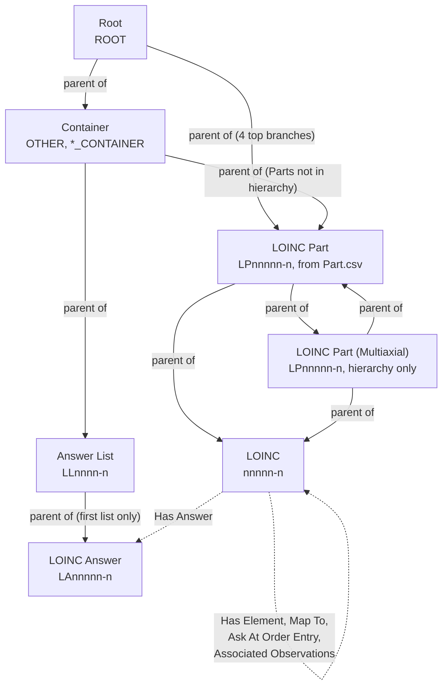

# 03. Output Model

This doc describes what the pipeline produces and loads into OCL: the files, the seven
concept classes, the five mapping types, and the hierarchy file. Every count is from the
LOINC 2.82 run.

All resources belong to one OCL Source: owner `Regenstrief` (Organization), source
`LOINC`. Every concept reference uses the relative URL
`/orgs/Regenstrief/sources/LOINC/concepts/<id>/` (the notebook's `CONCEPT_URL_PREFIX`
plus the id plus a trailing slash).

## Output files

| File | Format | Contents | 2.82 size |
|---|---|---|---|
| `output/concepts.json` | JSON Lines (one Concept object per line) | 252,212 concepts, parents before children as far as possible | ~730 MB |
| `output/mappings.json` | JSON Lines (one Mapping object per line) | 192,208 mappings | ~63 MB |
| `output/hierarchy_only.json` | One JSON object, pretty-printed | `{ parent_url: [child_url, ...] }`, keys and child lists sorted | ~19 MB |
| `QA-Load-files/qa_*.json` | Same three formats | 55-concept, 6-mapping consistent subset | < 100 KB |

The `.json` extension on the first two is a misnomer: they are JSON Lines, which is what
OCL's Bulk Import expects. `output/` is git-ignored. `QA-Load-files/` is committed.

## The model at a glance



Solid arrows are `parent_concept_urls` (hierarchy). Dotted arrows are Mappings.
Every mapping stays within the `LOINC` source. See [05 Hierarchy model](05-hierarchy-model.md)
for the tree.

## Concepts

### Common envelope

Every concept line has these fields. Empty values (None, NaN, empty string, empty
list/dict) are dropped before writing, so a field that has no value is absent, not
null.

| Field | Type | Value |
|---|---|---|
| `type` | string | `"Concept"` |
| `id` | string | Concept code, used as the OCL mnemonic |
| `concept_class` | string | One of the seven classes below |
| `datatype` | string | `SCALE_TYP` for `LOINC`; `"N/A"` for every other class |
| `source` | string | `"LOINC"` |
| `owner`, `owner_type` | string | `"Regenstrief"`, `"Organization"` |
| `retired` | boolean | `true` only when LOINC `STATUS`/`Status` = `DEPRECATED` |
| `names` | list | See [Names](#names). Always present. |
| `descriptions` | list | `LOINC` only, when `DefinitionDescription` is populated |
| `extras` | object | Class-specific. See the per-class sections. |
| `parent_concept_urls` | list of strings | Every concept except `ROOT` |
| `external_id` | string | UMLS CUI, same value as `extras.UMLS_CUI`, when found |

### Concept classes

| `concept_class` | Count | Built from | `id` pattern | `extras.Code_Type` |
|---|---:|---|---|---|
| `LOINC` | 109,325 | `Loinc.csv` row | `nnnnn-n` | `LOINC` |
| `LOINC Part` | 74,087 | Unique `Part.csv` `PartNumber` | `LPnnnnn-n` | `LOINC Part` |
| `LOINC Part (Multiaxial)` | 41,693 | `LP` code in the hierarchy file but not in `Part.csv` | `LPnnnnn-n` | *(none, see issues)* |
| `LOINC Answer` | 22,146 | Unique non-blank `AnswerList.csv` `AnswerStringId` | `LAnnnnn-n` | `LOINC Answer` |
| `Answer List` | 4,955 | Unique `AnswerList.csv` `AnswerListId` | `LLnnnn-n` | `LOINC Answer List` |
| `Container` | 5 | Hard-coded in Phase 6 | `OTHER`, `*_CONTAINER` | *(none, see issues)* |
| `Root` | 1 | Hard-coded in Phase 6 | `ROOT` | *(none, see issues)* |

### Names

OCL names are `{name, name_type, locale, locale_preferred}` objects. English names come
from the main CSVs. Translated names come only for `LOINC` terms, from the linguistic
variant files.

| Class | `name_type` (locale) | From | `locale_preferred` |
|---|---|---|---|
| `LOINC` | `Long-Common` (en) | `LONG_COMMON_NAME` | **true** |
| `LOINC` | `Display` (en) | `DisplayName` | false |
| `LOINC` | `Short` (en) | `SHORTNAME` | false |
| `LOINC` | `Consumer` (en) | `CONSUMER_NAME` (empty in 2.82) | false |
| `LOINC` | `Fully-Specified` (xx-YY) | Translated axes joined with `:` | false |
| `LOINC` | `Display` (xx-YY) | Translated `LONG_COMMON_NAME` | false |
| `LOINC` | `Short` (xx-YY) | Translated `SHORTNAME` | false |
| `LOINC` | `Related` (xx-YY) | Translated `RELATEDNAMES2` | false |
| `LOINC Part` | `Display` (en) | `PartDisplayName` | **true** |
| `LOINC Part` | `Long-Common` (en) | `PartName` | false |
| `LOINC Part (Multiaxial)` | `Long-Common` (en) | `CODE_TEXT` | **true** |
| `Answer List` | `Display` (en) | `AnswerListName` | **true** |
| `LOINC Answer` | `Display` (en) | `DisplayText` | **true** |
| `LOINC Answer` | `External` (en) | `ExtCodeDisplayName` | false |
| `Root`, `Container` | `Display` / `Short` (en) | Hard-coded | true / false |

In 2.82 the `LOINC` class carries about 2.2 million names in total. Most of these are
translations: 1,033,175 Fully-Specified, 596,798 Related, 294,581 Display and 189,577
Short. There is no English Fully-Specified name, and no translated name is marked
`locale_preferred`.

### `LOINC` (terms)

```json
{"concept_class": "LOINC", "datatype": "OrdQn", "id": "1-8", "owner": "Regenstrief",
 "owner_type": "Organization", "retired": false, "source": "LOINC", "type": "Concept",
 "extras": {"CHNG_TYPE": "MIN", "CLASS": "ABXBACT", "CLASSTYPE": 1.0, "COMMON_TEST_RANK": 7688.0,
   "COMPONENT": "Acyclovir", "Code_Type": "LOINC", "Code_in_Source": "1-8",
   "DisplayName": "Acyclovir [Susc]", "LONG_COMMON_NAME": "Acyclovir [Susceptibility]",
   "ORDER_OBS": "Both", "PROPERTY": "Susc", "RELATEDNAMES2": "Aciclovir; Acifur; ...",
   "SCALE_TYP": "OrdQn", "SHORTNAME": "Acyclovir Susc Islt", "STATUS": "ACTIVE",
   "SYSTEM": "Isolate", "TIME_ASPCT": "Pt", "VersionFirstReleased": "1.0",
   "VersionLastChanged": "2.73",
   "PATH_TO_ROOT": "LP432695-7.LP29693-6.LP343406-7.LP7755-4.LP31423-4.LP14522-4.LP380309-7",
   "HIERARCHY_SEQUENCE": 2.0, "UMLS_CUI": "C0362090"},
 "external_id": "C0362090",
 "parent_concept_urls": ["/orgs/Regenstrief/sources/LOINC/concepts/LP380309-7/"],
 "names": [{"name": "Acyclovir [Susceptibility]", "name_type": "Long-Common", "locale": "en", "locale_preferred": true},
           {"name": "Acyclovir [Susc]", "name_type": "Display", "locale": "en", "locale_preferred": false},
           {"name": "Acyclovir Susc Islt", "name_type": "Short", "locale": "en", "locale_preferred": false},
           "... plus translated names"]}
```

`datatype` values in 2.82: `Qn` 43,658; `Ord` 28,685; `Doc` 12,486; `Nom` 8,885;
`-` 7,465; `SemiQn` 4,261; `Nar` 1,938; `OrdQn` 1,519; `Set` 404; `Multi` 23; `*` 1.

Extras keys, with how many of the 109,325 terms carry each:

- **Always:** `Code_in_Source`, `Code_Type`, `COMPONENT`, `PROPERTY`, `TIME_ASPCT`,
  `SYSTEM`, `SCALE_TYP`, `CLASS`, `CLASSTYPE`, `STATUS`, `CHNG_TYPE`,
  `LONG_COMMON_NAME`, `RELATEDNAMES2`, `VersionFirstReleased`, `VersionLastChanged`,
  `PATH_TO_ROOT`, `HIERARCHY_SEQUENCE`.
- **Usually:** `UMLS_CUI` 104,237; `SHORTNAME` 95,827; `ORDER_OBS` 94,083;
  `UNITSREQUIRED` 71,359; `DisplayName` 66,935; `METHOD_TYP` 58,997.
- **Sometimes:** `EXAMPLE_UCUM_UNITS` 43,593; `EXAMPLE_UNITS` 40,524;
  `CHANGE_REASON_PUBLIC` 35,565; `COMMON_TEST_RANK` 19,978; `DEFINITION_DESCRIPTION`
  15,623; `SURVEY_QUEST_SRC` 10,039; `AssociatedObservations` 8,768;
  `SURVEY_QUEST_TEXT` 8,444; `HL7_ATTACHMENT_STRUCTURE` 8,193;
  `EXTERNAL_COPYRIGHT_NOTICE` / `_LINK` 7,305; `PanelType` 5,175; `EXMPL_ANSWERS`
  4,884; `STATUS_TEXT` 3,784; `STATUS_REASON` 2,756.
- **Rare:** `FORMULA` 754; `COMMON_ORDER_RANK` 313; `ValidHL7AttachmentRequest` 129;
  `HL7_FIELD_SUBFIELD_ID` 97; `AskAtOrderEntry` 65.

If a term sits under several hierarchy parents, `PATH_TO_ROOT` and `HIERARCHY_SEQUENCE`
become lists.

### `LOINC Part`

```json
{"concept_class": "LOINC Part", "datatype": "N/A", "id": "LP100001-9", "retired": false, "...": "...",
 "extras": {"Code_Type": "LOINC Part", "Code_in_Source": "LP100001-9",
   "LONG_COMMON_NAME": "Neonatal care report", "PartDisplayName": "Neonatal care report",
   "PartTypeName": "COMPONENT", "STATUS": "ACTIVE", "UMLS_CUI": "C2924491"},
 "names": [{"name": "Neonatal care report", "name_type": "Display", "locale": "en", "locale_preferred": true},
           {"name": "Neonatal care report", "name_type": "Long-Common", "locale": "en", "locale_preferred": false}],
 "external_id": "C2924491",
 "parent_concept_urls": ["/orgs/Regenstrief/sources/LOINC/concepts/LOINC_PARTS_CONTAINER/"]}
```

30,412 Parts also appear in the hierarchy file. These get hierarchy parents plus
`PATH_TO_ROOT`/`HIERARCHY_SEQUENCE` extras. The other 43,675 sit under
`LOINC_PARTS_CONTAINER`. 618 Parts have more than one parent (up to 6).

### `LOINC Part (Multiaxial)`

Hierarchy-only nodes: grouping Parts that LOINC publishes in
`ComponentHierarchyBySystem.csv` but not in `Part.csv`.

```json
{"concept_class": "LOINC Part (Multiaxial)", "datatype": "N/A", "id": "LP101895-3", "retired": false, "...": "...",
 "extras": {"PATH_TO_ROOT": "LP432695-7.LP7787-7.LP7840-4", "HIERARCHY_SEQUENCE": 171.0, "UMLS_CUI": "C4068578"},
 "names": [{"name": "Oxygen gas setting", "name_type": "Long-Common", "locale": "en", "locale_preferred": true}],
 "external_id": "C4068578",
 "parent_concept_urls": ["/orgs/Regenstrief/sources/LOINC/concepts/LP7840-4/"]}
```

### `Answer List`

```json
{"concept_class": "Answer List", "datatype": "N/A", "id": "LL1-9", "retired": false, "...": "...",
 "extras": {"AnswerListName": "Gender_M/F", "AnswerListOID": "1.3.6.1.4.1.12009.10.1.1077",
   "Code_Type": "LOINC Answer List", "Code_in_Source": "LL1-9", "ExtDefinedYN": "N"},
 "names": [{"name": "Gender_M/F", "name_type": "Display", "locale": "en", "locale_preferred": true}],
 "parent_concept_urls": ["/orgs/Regenstrief/sources/LOINC/concepts/ANSWER_LISTS_CONTAINER/"]}
```

Optional extras: `ExtDefinedAnswerListCodeSystem` (164), `ExtDefinedAnswerListLink`
(71). Answer Lists are never looked up in UMLS, so they have no CUI.

### `LOINC Answer`

```json
{"concept_class": "LOINC Answer", "datatype": "N/A", "id": "LA1-0", "retired": false, "...": "...",
 "extras": {"Code_Type": "LOINC Answer", "Code_in_Source": "LA1-0", "DisplayText": "UTD",
   "SequenceNumber": "3", "UMLS_CUI": "C3845665"},
 "names": [{"name": "UTD", "name_type": "Display", "locale": "en", "locale_preferred": true}],
 "external_id": "C3845665",
 "parent_concept_urls": ["/orgs/Regenstrief/sources/LOINC/concepts/LL50-6/"]}
```

Optional extras: `LocalAnswerCode` 10,261; `Score` 1,427; `Description` 566;
`ExtCodeId`/`ExtCodeSystem` 550; `ExtCodeDisplayName` 531;
`ExtCodeSystemCopyrightNotice` 514; `ExtCodeSystemVersion` 459;
`LocalAnswerCodeSystem` 74; `SubsequentTextPrompt` 44.

The parent is the **first** Answer List the answer appears in. `SequenceNumber`,
`Score` and `LocalAnswerCode` on the concept also come from that first appearance.
For per-list values, use the `Has Answer` mapping extras.

### `Root` and `Container`

| `id` | Class | Display name | Parent | Children in 2.82 |
|---|---|---|---|---:|
| `ROOT` | Root | LOINC Root Concept | none | 5 (`OTHER` + 4 top-level Parts) |
| `OTHER` | Container | Other LOINC Containers | `ROOT` | 4 |
| `LOINC_PARTS_CONTAINER` | Container | LOINC Parts Container | `OTHER` | 43,675 |
| `ANSWER_LISTS_CONTAINER` | Container | Answer Lists Container | `OTHER` | 4,955 |
| `LOINC_CONTAINER` | Container | LOINC Terms Container | `OTHER` | 0 |
| `LOINC_ANSWERS_CONTAINER` | Container | LOINC Answers Container | `OTHER` | 0 |

The code also defines `descriptions` and `extras` (`Code_Type`, `Code_in_Source`,
`Container_For`) for these, but they are dropped in the output step. See
[07](07-data-quality-and-known-issues.md).

## Mappings

### Envelope

```json
{"type": "Mapping", "map_type": "<see below>",
 "from_concept_url": "/orgs/Regenstrief/sources/LOINC/concepts/<from>/",
 "to_concept_url": "/orgs/Regenstrief/sources/LOINC/concepts/<to>/",
 "source": "LOINC", "owner_type": "Organization", "owner": "Regenstrief",
 "extras": {"...": "only when non-empty"}}
```

Mappings have no `id`. OCL assigns one on import. All targets are internal to the
`LOINC` source. In 2.82 every `from` and `to` resolves to a concept in `concepts.json`.

### Map types

| `map_type` | Count | Meaning | From | To | Extras |
|---|---:|---|---|---|---|
| `Has Answer` | 114,448 | A term's answer list includes this answer | `LOINC` | `LOINC Answer` | `Answer List ID` (always), `Answer List Type` (always: NORMATIVE / EXAMPLE / PREFERRED), `Sequence` (always), `Local Answer Code` (35,005), `Score` (24,845) |
| `Has Element` | 55,326 | A panel contains this element | `LOINC` (panel) | `LOINC` (element or sub-panel) | `Answer List Override`, `Answer List Type Override` (2,857 each) |
| `Associated Observations` | 17,712 | Term has an associated observation | `LOINC` | `LOINC` | none |
| `Map To` | 4,657 | Deprecated term replaced by | `LOINC` (deprecated) | `LOINC` (replacement) | `COMMENT` (266) |
| `Ask At Order Entry` | 65 | Question to ask when ordering this term | `LOINC` | `LOINC` | none |

`Has Answer` points to the individual answers, not the Answer List concept. The list
appears only as the `Answer List ID` extra. A term bound to a 5-answer list therefore gets
5 `Has Answer` mappings.

Examples:

```json
{"type": "Mapping", "map_type": "Has Answer", "from_concept_url": ".../concepts/100002-5/", "to_concept_url": ".../concepts/LA10105-7/", "...": "...", "extras": {"Answer List ID": "LL6136-7", "Answer List Type": "NORMATIVE", "Sequence": "4"}}
{"type": "Mapping", "map_type": "Has Element", "from_concept_url": ".../concepts/100017-3/", "to_concept_url": ".../concepts/100002-5/", "...": "...", "extras": {"Answer List Override": "LL6136-7", "Answer List Type Override": "NORMATIVE"}}
{"type": "Mapping", "map_type": "Map To", "from_concept_url": ".../concepts/1009-0/", "to_concept_url": ".../concepts/1007-4/", "...": "..."}
```

## `hierarchy_only.json`

A single JSON object. Each key is a parent concept URL. Each value is the sorted list of
its children's URLs. It is built from the final `parent_concept_urls` of every concept,
so it expresses the same tree as `concepts.json`. It exists so the hierarchy can be
applied in one admin operation after concepts are imported without parents enforced
(see [05](05-hierarchy-model.md#applying-the-hierarchy-in-ocl)).

```json
{
  "/orgs/Regenstrief/sources/LOINC/concepts/ANSWER_LISTS_CONTAINER/": [
    "/orgs/Regenstrief/sources/LOINC/concepts/LL1-9/",
    "..."
  ],
  "/orgs/Regenstrief/sources/LOINC/concepts/ROOT/": [
    "/orgs/Regenstrief/sources/LOINC/concepts/LP29693-6/",
    "/orgs/Regenstrief/sources/LOINC/concepts/LP29695-1/",
    "/orgs/Regenstrief/sources/LOINC/concepts/LP29696-9/",
    "/orgs/Regenstrief/sources/LOINC/concepts/LP7787-7/",
    "/orgs/Regenstrief/sources/LOINC/concepts/OTHER/"
  ]
}
```

2.82: 59,948 parent keys, 252,973 parent-child edges. One key,
`LP432695-7`, is a concept that is never created. See
[07](07-data-quality-and-known-issues.md).

## Source properties vs emitted extras

The Source definition's `properties` list documents extras for OCL's UI and FHIR
CodeSystem export. It does not match the emitted extras one-to-one.

**Emitted but not declared as properties:** `Code_Type`, `Code_in_Source`,
`PATH_TO_ROOT`, `HIERARCHY_SEQUENCE`, `UMLS_CUI`, `DEFINITION_DESCRIPTION`, and every
Part, Answer List and Answer extra:

- Part: `PartTypeName`, `PartDisplayName`.
- Answer List: `AnswerListName`, `ExtDefinedAnswerListCodeSystem`,
  `ExtDefinedAnswerListLink`.
- Answer: `DisplayText`, `SequenceNumber`, `LocalAnswerCode`, `LocalAnswerCodeSystem`,
  `ExtCodeId`, `ExtCodeDisplayName`, `ExtCodeSystem`, `ExtCodeSystemVersion`,
  `ExtCodeSystemCopyrightNotice`, `SubsequentTextPrompt`, `Description`, `Score`.

**Declared but never emitted:**

- `DefinitionDescription`: emitted under the name `DEFINITION_DESCRIPTION`.
- `CONSUMER_NAME`: empty in 2.82.
- `MAP_TO`.
- The FHIR-style property codes `parent`, `child`, `answer-list`, `analyte`,
  `analyte-core`, `analyte-suffix`, `challenge`, `adjustment`, `time-core`,
  `time-modifier`, `system-core`, `super-system`, `category`, `search`, `type`, `tags`,
  `code_systems`, `external_code_system`, `external_link`, `anchored_to`, `answers`,
  `loincs`, `answer_list_id`, `common_panel_loinc`, `test_loinc_num`.
- `concept_class`: a top-level field, not an extra.

Whether to reconcile these is an open modeling decision.
