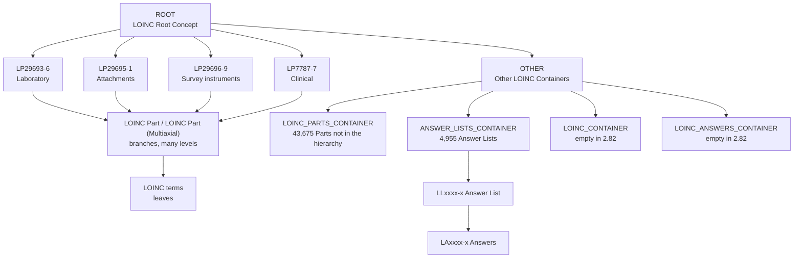
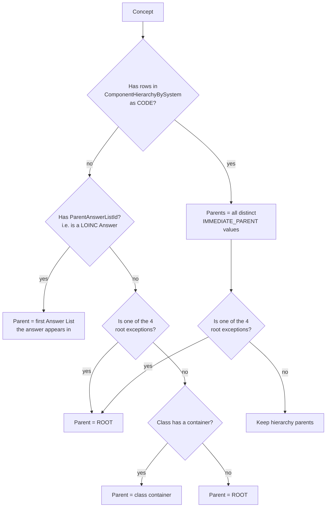

# 05. Hierarchy Model

OCL lets a Source define a browsable concept tree. Each concept carries
`parent_concept_urls`, and the Source's `hierarchy_root_url` names the top concept. For
LOINC that root is `/orgs/Regenstrief/sources/LOINC/concepts/ROOT/`. This doc explains
how the pipeline builds that tree from LOINC's multi-axial hierarchy and how it is
applied in OCL.

## The tree



A real path from the QA sample (7 levels):

```
ROOT > LP29693-6 > LP343406-7 > LP7755-4 > LP31426-7 > LP267482-0 > LP431707-1 > 100041-3
```

There are two halves:

- **The LOINC multi-axial tree** (under the four top-level Parts). This comes straight
  from `ComponentHierarchyBySystem.csv` and holds every LOINC term plus the Parts that
  group them.
- **Synthetic containers** (under `OTHER`). These are created by the notebook so that
  concepts LOINC does not place in its tree still have a parent: flat Parts, Answer
  Lists, and (through their lists) Answers.

## Source of the multi-axial tree

`ComponentHierarchyBySystem.csv` has one row per (node, parent) pair. LOINC's own top
node is `LP432695-7`, displayed as `{component}`. The pipeline deliberately **does not
create** `LP432695-7`. Instead:

- `ROOT` takes its place.
- Its four children (`LP29693-6` Laboratory, `LP29695-1` Attachments,
  `LP29696-9` Survey instruments, `LP7787-7` Clinical) are hard-wired to `ROOT` in
  three places: the orphan step (cell 40), the concept writer (cell 42) and the
  hierarchy writer (cell 43). The list is duplicated in each place, so a change must be
  made in all three.

Branch nodes (`LP` codes) fall into two classes:

| Branch node is... | Concept class | 2.82 count |
|---|---|---:|
| Listed in `Part.csv` | `LOINC Part` (keeps its Part.csv attributes, gains hierarchy parents) | 30,412 |
| Only in the hierarchy file | `LOINC Part (Multiaxial)` (built from `CODE_TEXT`) | 41,693 |

Leaves are LOINC terms. In 2.82 every one of the 109,325 terms has at least one
hierarchy parent, so `LOINC_CONTAINER` ends up empty.

## How each concept's parents are decided



Class-to-container fallback (cell 40, `assign_orphaned_concepts_to_containers`):

| `concept_class` | Container |
|---|---|
| `LOINC` | `LOINC_CONTAINER` |
| `LOINC Part` | `LOINC_PARTS_CONTAINER` |
| `LOINC Answer` | `LOINC_ANSWERS_CONTAINER` |
| `Answer List` | `ANSWER_LISTS_CONTAINER` |
| anything else | `ROOT` (with a printed warning) |

`LOINC Part (Multiaxial)` has no container because every Multiaxial part comes from the
hierarchy file and so always has a parent.

## Multiple parents

LOINC's tree is a polyhierarchy: one node can sit under several branches. Phase 4 keeps
all of them.

- It left-joins concepts to all hierarchy rows (one output row per concept-parent pair).
- It groups by concept `id` and collects distinct parents, `PATH_TO_ROOT` values and
  `SEQUENCE` values.
- A single parent stays a scalar. Several parents become lists, for
  `parent_concept_urls` and also for `extras.PATH_TO_ROOT` and
  `extras.HIERARCHY_SEQUENCE`.

2.82 distribution:

| Class | 1 parent | 2 | 3 | 4 | 5 | 6 |
|---|---:|---:|---:|---:|---:|---:|
| `LOINC Part` | 73,469 | 548 | 54 | 12 | 3 | 1 |
| `LOINC Part (Multiaxial)` | 41,644 | 49 | | | | |
| All other classes | all | | | | | |

Answers are the exception to "keep all parents". An answer used in several lists (4,127
in 2.82) gets only the first list as its parent. The full list-to-answer membership is
still available through the `Has Answer` mapping extras (`Answer List ID`).

## Ordering in `concepts.json`

Cell 40 runs a topological sort so parents appear before their children, which helps an
importer that resolves parents as it goes. It works in passes: each pass emits every
concept whose parents have all been emitted.

In practice the sort emits `ROOT`, the containers and the flat concepts in the first few
passes. It then finds no "ready" concept and prints
`Possible circular dependencies detected`. It appends everything left, sorted only by
how many unprocessed parents each concept has. The separate cycle check in the same cell
reports **0 cycles**.

**Likely root cause.** At sort time the four top-level Parts still point at their LOINC
parent `LP432695-7`. That concept never exists, so they can never become "ready". Their
override to `ROOT` happens later, in cell 42. Every node beneath them is therefore
blocked too. The numbers fit exactly: in the 2.81 run, 180,578 concepts were left
unsorted, which is the 180,579 unique codes in the hierarchy file minus `LP432695-7`
itself. Moving the root-exception override to before the sort (cell 40) should let the
topological sort complete.

The practical effect today: the whole multi-axial tree in `concepts.json` is in
arbitrary order, not parent-before-child. The `parent_concept_urls` values themselves are
correct. This matters only if the importer is order-sensitive, which is one reason the
hierarchy is applied as a separate step.

## Applying the hierarchy in OCL

The documented process imports concepts with Bulk Import **with the Hierarchy option
unchecked**, then applies the tree in one admin call using `hierarchy_only.json`.

`hierarchy_only.json` is the inverse of `parent_concept_urls`:
`{ "<parent url>": ["<child url>", ...] }`. It is built from the same final DataFrame as
`concepts.json` (cell 43). It then has the four root exceptions added under `ROOT`
again, for safety.

In oclapi2 this file is the request body for the admin-only endpoint
`POST /admin/concepts/amend-hierarchy/`. That endpoint queues a `make_hierarchy` task.
For each parent URL that exists, the task adds that parent to each listed child, on both
the concept and its latest version. Two properties to know:

- **It is additive.** It adds parent links and never removes them. Re-applying the same
  file is safe. Applying a corrected file does not undo a wrong link from an earlier
  load.
- **Unknown parents are skipped and logged.** The file contains one parent key for a
  concept that is never created (`LP432695-7`, see
  [07](07-data-quality-and-known-issues.md)). That key is skipped harmlessly.

The 2.81 production load split `hierarchy_only.json` into roughly 5 MB pieces with
[`File Splitter.ipynb`](../File%20Splitter.ipynb) before posting. Each piece is a valid
subset (whole parent keys), so pieces can be posted in any order.

> Newer oclapi2 bulk importers can also collect `parent_concept_urls` from the imported
> concept lines and build the hierarchy after the load. Confirm with the OCL API team
> which path to use for a given environment before the next production load.
