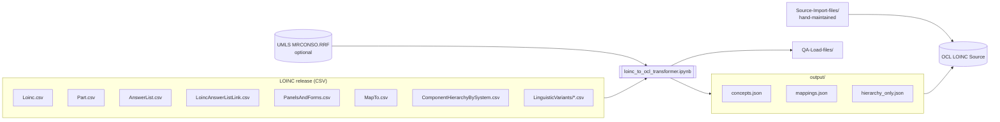

# LOINC-OCL-ETL Documentation

This folder documents how the LOINC-OCL-ETL pipeline turns a LOINC release into
files that can be loaded into OCL (Open Concept Lab). It covers the data model on both
sides of the transformation, the rules that connect them, and the process for running
it each release.

The top-level [README](../README.md) is the quick-start for running the notebook.
These docs are the reference behind it.

## What the pipeline does, in one paragraph

[`loinc_to_ocl_transformer.ipynb`](../loinc_to_ocl_transformer.ipynb) reads the CSV
files from a LOINC release (plus, optionally, UMLS `MRCONSO.RRF`). It builds OCL
**Concepts** for LOINC terms, LOINC Parts, Answer Lists and Answers, and OCL
**Mappings** for five kinds of LOINC relationships. It also assigns every concept one or
more parents so that the LOINC multi-axial hierarchy can be browsed in OCL. It writes
three files: `concepts.json` and `mappings.json` (OCL Bulk Import JSON Lines) and
`hierarchy_only.json` (parent-to-children map applied after import).

## Reading order

| Doc | Read it when you want to know... |
|---|---|
| [01 Pipeline overview](01-pipeline-overview.md) | How the notebook is organized, phase by phase, and what state flows between phases. |
| [02 Input model](02-input-model.md) | Which LOINC release files are used, how they relate, and which columns are used or ignored. |
| [03 Output model](03-output-model.md) | The shape of every concept class, mapping type and output file that gets loaded into OCL. |
| [04 Field mappings](04-field-mappings.md) | The column-by-column crosswalk from LOINC CSV to OCL fields, and every value transformation. |
| [05 Hierarchy model](05-hierarchy-model.md) | How parents are assigned, what the containers are, and how the hierarchy is applied in OCL. |
| [06 Release process](06-release-process.md) | The end-to-end runbook, from downloading a release to verifying it in OCL. |
| [07 Data quality and known issues](07-data-quality-and-known-issues.md) | Built-in checks, a verification checklist, and open issues with their impact. |
| [08 Folder reference](08-folder-reference.md) | What every file and folder in `LOINC-OCL-ETL/` is for and whether it is tracked in git. |
| [Glossary](glossary.md) | LOINC, OCL and UMLS terms used throughout. |

## Key numbers (LOINC 2.82 run)

These come from the `output/` files produced by the most recent full run. Use them as a
baseline when checking a new release. Counts should grow modestly, not swing wildly.

| Output | Count |
|---|---:|
| Concepts, total | 252,212 |
| `LOINC` | 109,325 |
| `LOINC Part` | 74,087 |
| `LOINC Part (Multiaxial)` | 41,693 |
| `LOINC Answer` | 22,146 |
| `Answer List` | 4,955 |
| `Container` / `Root` | 5 / 1 |
| Mappings, total | 192,208 |
| `Has Answer` | 114,448 |
| `Has Element` | 55,326 |
| `Associated Observations` | 17,712 |
| `Map To` | 4,657 |
| `Ask At Order Entry` | 65 |
| Concepts with a UMLS CUI | 230,060 (UMLS 2025AA) |
| `hierarchy_only.json` parent keys / parent-child edges | 59,948 / 252,973 |

## Keeping these docs current

The notebook is the source of truth. When you change a field-mapping dictionary,
a `MAPPING_CONFIGS` entry, a concept class, or the container structure, update
[04 Field mappings](04-field-mappings.md) and [03 Output model](03-output-model.md) in
the same commit. After each release run, refresh the key numbers above and review the
issues list in [07](07-data-quality-and-known-issues.md).
